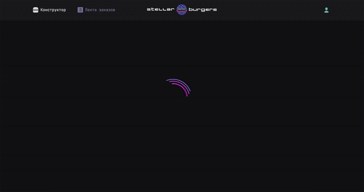

<h1 align="center"></h1>

## Краткое описание:

 "Stellar Burgers" - одностраничное приложение, позволяющее собрать и заказать свой уникальный межгалактический бургер

[Открыть в браузере](http://rochernikov.github.io/react-burger/)

### Функционал:

- с помощью перетаскивания соберите свой межгалактический бургер
- список ингредиентов приходит с публичного API

### Функцианал в разработке:

- регистрация/авторизация пользователя
- Защищенный роутинг
- Лента заказов (WebSocket)

### Технологии, использованные при создании:

- React.js (CRA)
- TypeScript
- Redux (Redux-toolkit, thunk)
- React DND
- Работа с публичным API
- Flexbox
- Grid Layout
- CSS - animation
- Семантическая верстка
- Использована библиотека UI-компонентов [Яндекс.Практикум.Реакт](https://github.com/yandex-praktikum/react-developer-burger-ui-components)

Проект сверстан для настольных компьютеров (разрешение 1280x720 и выше, статическая верстка).

### Языки:

- HTML
- CSS
- TypeScript
- JSX

### Внешние компоненты

Для работы с проектом вам понадобятся git, NodeJS

- [Как установить git.](https://git-scm.com/book/en/v2/Getting-Started-Installing-Git)
- [Как установить NodeJS.](https://nodejs.org/en/download/package-manager/)

### Локальная установка:

В командной строке перейдите в папку, где будет развернут проект. После чего скопируйте его с GitHub:
`$ git clone git@github.com:RoChernikov/react-burger.git`

Далее переходим в папку с проектом и устанавливаем компоненты:
`$ npm install`

Далее можно запускать проект на локальном сервере:
`$ npm start`

### Деплой проекта:

Устанавливаем пакет для выкладывания проекта на gh-pages:
`$ npm install gh-pages --save-dev`

Деплой:
`$ npm run deploy`

## Ссылки:

[Макет](<https://www.figma.com/file/Z8DHldjVbvhQXtrkmJR8CU/React-%2F-Проектные-задачи-(3-месяца)?node-id=0%3A1>)

- [Ссылка на GitHub Pages](http://rochernikov.github.io/react-burger/)

- [По вопросам доработки сайта](https://t.me/ro_runner)

## Проектная работа: "Stellar Burgers". Создана в рамках учебы в [Яндекс.Практикум](https://praktikum.yandex.ru/) на курсе ["Веб-разработчик плюс"](https://practicum.yandex.ru/web-plus/).
